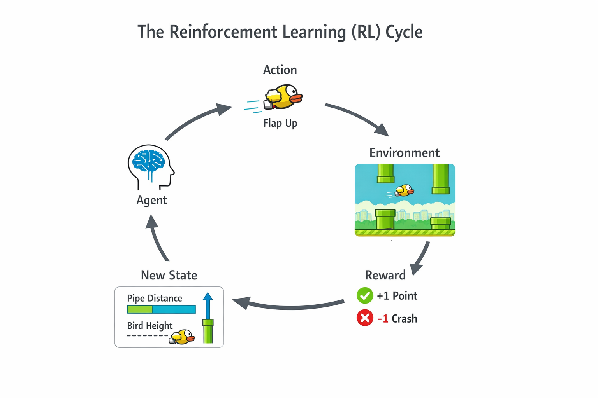
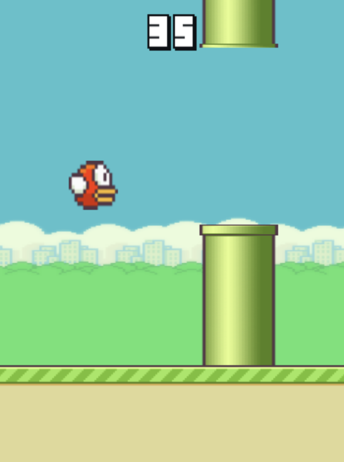

Reinforcement learning is the area in machine learning that still feels like magic to me. And if I want to do some magic myself, I will have to learn some spells. Better said, I can't do reinforcement learning without knowing how it works. That's why I dove into reinforcement learning by making my own Flappy Bird clone and having an RL agent play the game for me. In this post I go into the struggles I faced in getting a bird to flap by itself. 

Sounds interesting? Then read along. Just want to look at (or try to defeat) a flapping bird? Then [scroll down](#beat-my-agent).


## Reinforcement learning terminology
First of all, the basics. RL works by having a computer program (often called an *agent*) engage with *something*. In my case, the Flappy Bird game. Every frame of the game, the agent makes an *observation*, the inputs to the program. A good agent will then make the right *action* in the environment, advancing it to the next *state*, where it will receive another observation, etc., etc. In my case a state is simply a snapshot of the game, and a possible observation could be the location of the next pipe. The action is of course to flap or not to flap.

{fig-alt="a clean, modern diagram illustrating the Reinforcement Learning (RL) cycle using the Flappy Bird game. The diagram shows a small yellow bird (Flappy Bird–style) flying between green pipes. The RL loop is visualized with arrows in a circular flow: Agent → Action → Environment → Reward → New State → Agent. The agent is represented as a small AI brain or neural network icon controlling the bird. The environment is the Flappy Bird world with sky background and pipes. The action is the bird flapping upward. The reward is shown as +1 points when passing a pipe and a negative reward when crashing. The state shows distances to pipes and bird height as simple visual indicators."}

## Going in blind
I am not much of a game developer, so when I looked up how to render things to the screen, one of the first things I saw was the HTML canvas, which would require me to program in JavaScript. Small issue, I only know Python and C#. Luckily I did not need to write production-grade code, and after around 5 days of tutorials and documentation reading, I had myself a Flappy Bird game. Now I only needed to make it play itself, but how? I looked on the internet and found some slightly heartbreaking results.

## Reinforcement learning made easy with Gymnasium
The first thing I found was a framework called Gymnasium (which was created by OpenAI). It makes training an agent really easy by providing a common API for any training environment. Several out-of-the-box environments also exist to practice your skills. It is written in Python, which is a good choice since most people know it, and it is the language of PyTorch. However, I had already committed almost a week of time to learning JavaScript, so I looked if a JavaScript version existed. Unfortunately, there did not. I now had the choice of making my own Gymnasium-like JavaScript API or rewriting the entire thing in Python. At first I opted for sticking to JavaScript, but after realising that I eventually had to train an agent, which would probably need Python (sorry to all TensorFlow.js fans out there) I chose Gymnasium. It even has a Flappy Bird environment,but using that would make things way too easy and what's the fun in that?. Since I'm doing this as a learning opportunity, I decided to make my own.

Gymnasium makes it pretty easy to make your own environment, and if you are interested, I recommend reading the same [quick tutorial page](https://Gymnasium.farama.org/tutorials/gymnasium_basics/environment_creation/) as I did since I won't be going over it here.

{width=50% fig-align="center"}

## Time to train!
After creating my world-class Flappy Bird environment I needed to actually train my agent. I had not read any theory yet, and just wanted an actually flapping bird, so I decided to use the stable-baselines-3 library, which makes training an agent on a Gymnasium-API compatible environment ridiculously easy (in theory). To train an agent, you have to select one of several available training algorithms. I selected the Deep Q-Network (DQN) method, which seemed like a natural extension of Q-learning, but for continuous observation spaces.

### Intermezzo: Q-learning
Prior to all of this, I experimented with the out-of-the-box environments of Gymnasium, and followed a tutorial to solve the blackjack environment using Q-learning. It works by creating a giant table of (expected reward) values for every action and state. The higher the value in a cell $c_{sa}$, the better it is to perform action $a$ at state $s$. The agent then updates values as it learns according to the Bellman equation. This works fine for discrete observation spaces, since the table will have a finite size. However, in a Flappy Bird environment, the velocity of the bird can be 10, or 10.1, or 10.01, etc. We will never get a good table since we will most likely observe a never-seen-before state at every timestep. Deep Q-learning tries to overcome this problem by having a neural network estimate the Q-values of the cells in the table. (Or at least, I think it does, I'm still new to this)

## I understand it now...
So DQN it was, there was only one issue... No learning was happening! Or at least not what I had envisioned. The best my agent did was get past the first pipe. I trained the agent again, this time for longer, and still no difference. I changed my observations to absolute positions of the bird and pipes instead of relative to the agent, still no difference. I thought I might have coded my environment wrong, so I added a debug mode that added visuals of what the agent was 'seeing', but things looked as expected. I truly had no idea what was going wrong. I tried different training algorithms: PPO and A2C, but still no improvement. I then thought that maybe the task was too difficult, and made an option in the environment to have the first N pipes spawn at the same location, but this also caused no improvement. I now see that reinforcement learning is not as straightforward as I initially thought. I let the project sit for over a week since I had a busy period at school. 

## Finally, a flapping bird
On a random wednesday afternoon I returned to the project. I systematically changed variables in the learning process, when all of a sudden I stumbled upon an amazing agent. 
At this point I was doing a lot of testing to figure out why my agent was not learning to pass the pipes, so I had wrapped my environment in a vectorized environment, which drastically sped up training. In the golden run I had returned to some things I initially moved away from, such as PPO and relative object positions. I also added something new. I now normalized observations and actions by wrapping my environment with ```VecNormalize```. Boom, over a 100 pipes passed (Which was the maximum an agent could reach with the training timestep-limit I had in place). I did some meticulous A/B testing and I am sure that the major factor in the improvement came from ```VecNormalize```. On one hand this felt almost like cheating, since after such a small change suddenly the agent performed great! But on the other hand it was a validation that my environment and training setup were correctly implemented.

## Other optimalizations
Beside normalization, other things that seemed to improve both agent performance and training process were tuning the parameters of PPO, and increasing the amount of environments in the vectorized environment. Additionally, shaping the rewards to give more feedback per timestep to the agent also improved the agent quite a lot. I did this by including a penalty for moving away from the center of the gap in the pipes. However, without normalization the agent still performed poorly! The major improvement definitely came from normalizing observations and actions. If you want to train your own bird using my environment, or see the code, go over to [my GitHub](https://github.com/liamgroen/flappy-bird-training)

## Beat my agent!
I finally reached my goal of having Flappy Bird play itself! What you are seeing below is my agent playing my environment live in your browser, no prerecorded shenanigans. If you want to play against it, you can too.  If you're feeling lucky, select 'Duel' and try to beat it!  If you are curious how I made my agent play on this page, check out [this tutorial I made](../pytorch-basics/day-6-deploying-model-to-huggingface-spaces-through-onnx/index.qmd), or go over to my [Hugging Face account](https://huggingface.co/spaces/liamgroen/Flappy-Bird-RL-Agent/tree/main)!

<div class="iframe-container">
<iframe
	src="https://liamgroen-flappy-bird-rl-agent.hf.space"
	frameborder="0"
></iframe>
</div>
