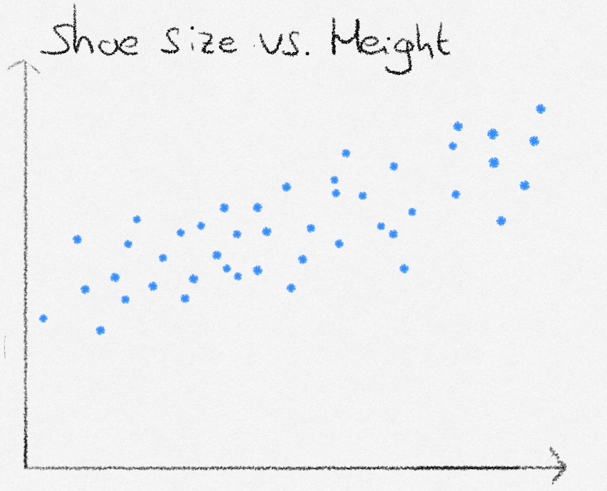
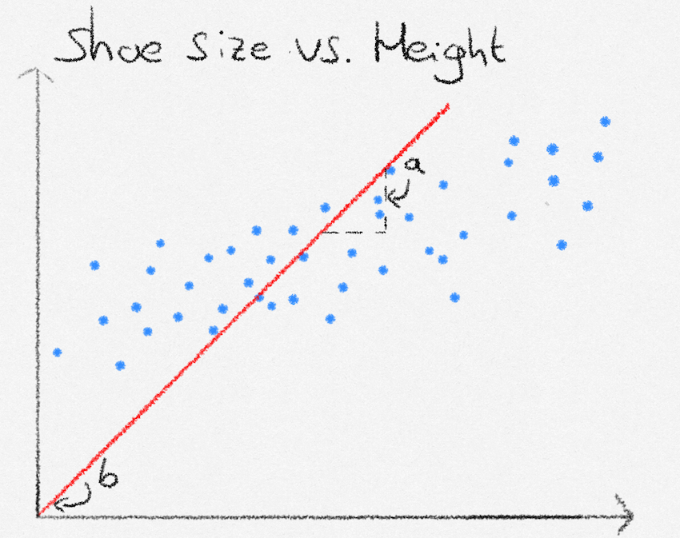
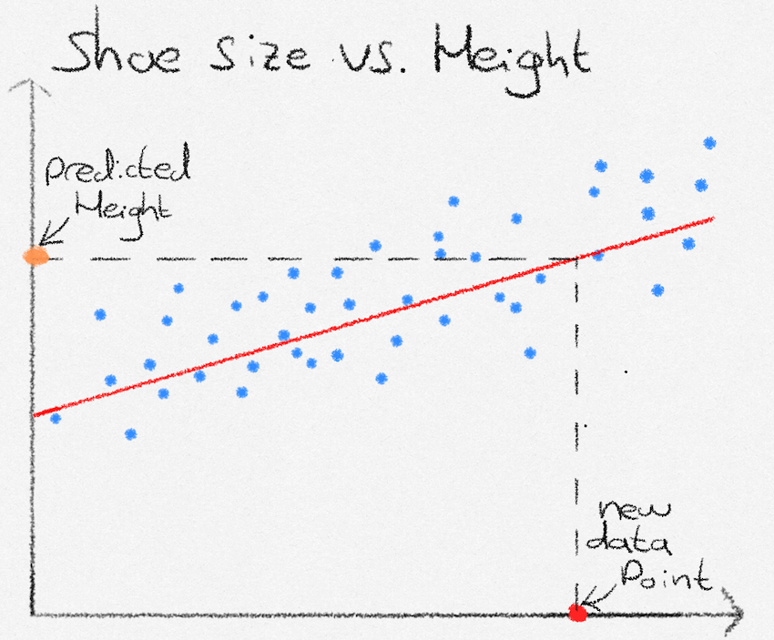

## What is linear regression?
In this post I will be taking you through the basics of a fundamental machine learning problem: regression. 

Let's say we want to predict a person's height, based on their shoe size. To tackle the task, we are going to use linear regression. The first thing we will need is data on people's shoe size and their corresponding height. 

{height=340}

Our goal, using linear regression, is to create a formula where we can enter in someone's shoe size, and that computes their height. Looking at the data, the general pattern seems to follow one of a straight line. The formula we will thus use, is the straight line equation $y = ax + b$, where $y$ is the height, and $x$ is the shoe size.

{height=340}

Next, we need to find proper values for the slope and intercept of our straight line equation. This is where linear regression comes into play. Linear regression allows us to find the values of slope and intercept that 'fit the line best to the data', meaning that on average the distance to the line and the data is small.

We will use the following function to measure how good the line fits to our data: 
$$
\mathcal{L} = \frac{1}{N} \sum^N_{i=1}{(y_i - f(x_i))^2}
$$

This function computes $\mathcal{L}$, the average distance between the line (predicted heights) and data points (actual heights), where $N$ is the amount of data points, $y_i$ is the target value (a person's height) and $f(x_i)$ is the function that estimates height given a shoe size $x_i$.

If we find the line that corresponds to the lowest value of $\mathcal{L}$, we have found the line that lies, on average, closest to all data points. The central belief in linear regression is that unseen data points will also lie close to the line, allowing us to make predictions. In our case, the prediction function $f(x_i)$ is our straight line equation

$$
ax + b
$$

Which could suit as a good estimation line, given suitable parameter values (weights) $a$ and $b$ for intercept and slope. 

Our task now is to find the weights that minimize 

$$
\mathcal{L} = \frac{1}{N} \sum^N_{i=1}{(y_i - (ax_i + b))^2}
$$

## How to find the optimal linear regression weights? 
This next section is more technical and requires a basic understanding of linear algebra and a little matrix calculus. Feel free to skip over it, the calculations made are not necessary for an understanding of linear regression. However, those of you who enjoy the mathematics (such as myself), will hopefully find the next section delightfully elegant. We start with a change in notation, and drop the familiar $ax_i +b$ in favour of $w_0 + w_1x_i$, which states exactly the same, but whose coefficients are easier to generalize to vector data points.

Let us now define $\mathbf{x}_i$ as $\mathbf{x}_i = \begin{pmatrix}1 & x_i \end{pmatrix}^\top$. This allows us to neatly express $f(x_i) =  w_0 \cdot 1 + w_1 \cdot x_i$, as $\mathbf{w}^\top\mathbf{x}_i$, and we can begin to rewrite our original expression for $\mathcal{L}$.
$$
\begin{align}
\mathcal{L} &= \frac{1}{N} \sum^N_{i=1}{(y_i - \mathbf{w}^\top\mathbf{x}_i)^2} \\
&= \frac{1}{N}(\mathbf{y} - \mathbf{Xw})^\top(\mathbf{y} - \mathbf{Xw})
\end{align}
$$

Where 

$$
\mathbf{X} = \begin{pmatrix}
\mathbf{x}_0^\top \\
\vdots \\
\mathbf{x}_N^\top
\end{pmatrix}, \quad \mathbf{w} = \begin{pmatrix}
w_0 \\
w_1 
\end{pmatrix},\quad \mathbf{y} = \begin{pmatrix}
y_0 \\
y_1 \\
\vdots \\
y_N
\end{pmatrix}
$$

Since our loss is quadratic, we can find the lowest point by differentiating with respect to $\mathbf{w}$, equating to zero, and solving for $\mathbf{w}$. This will give the weights corresponding to the line with the lowest average distance from the data points.

We start by foiling out the expression
$$
\begin{align}
& \frac{1}{N}(\mathbf{y} - \mathbf{Xw})^\top(\mathbf{y} - \mathbf{Xw})\\
&= \frac{1}{N}(\mathbf{y}^\top - \mathbf{w}^\top\mathbf{X}^\top)(\mathbf{y} - \mathbf{Xw}) \\
&= \frac{1}{N}(\mathbf{y}^\top\mathbf{y} - \mathbf{w}^\top\mathbf{X}^\top\mathbf{y} - \mathbf{y}^\top\mathbf{Xw} + \mathbf{w}^\top\mathbf{X}^\top\mathbf{Xw}) \\
&= \frac{1}{N}\mathbf{y}^\top\mathbf{y} - \frac{2}{N}\mathbf{w}^\top\mathbf{X}^\top\mathbf{y} + \frac{1}{N}\mathbf{w}^\top\mathbf{X}^\top\mathbf{Xw}
\end{align}
$$

Differentiating with respect to $\mathbf{w}$ we get

$$
\frac{\partial\mathcal{L}}{\partial\mathbf{w}} = -\frac{2}{N}\mathbf{X}^\top\mathbf{y} + \frac{2}{N}\mathbf{X}^\top\mathbf{X}\mathbf{w} 
$$

Equating to zero and solving for $\mathbf{w}$:^[The astute reader might notice that the last step assumes that the inverse of $\mathbf{X}^\top\mathbf{X}$ exists, which in practice is not always the case, for example, when the number of features is greater than the number of data points. In practice $\mathbf{X}$ is decomposed using QR or SV decomposition, which gets rid of the invertibility requirement]

$$
\begin{align}
&\mathbf{X}^\top\mathbf{X}\mathbf{w} = \mathbf{X}^\top\mathbf{y}\\
&\hat{\mathbf{w}} = (\mathbf{X}^\top\mathbf{X})^{-1}\mathbf{X}^\top\mathbf{y}
\end{align}
$$

## How to make predictions using the optimal weights? 
Now that we have found parameters for $a$ and $b$, we can plug these into our straight line equation. We are now able to predict heights. Given a not-seen-before datapoint of someone's shoe size (red point), we see that our formula predicts that their height is at the orange point.

{height=340}

## What next?
This introduction covered the basis of linear regression, and how we can use it to predict a quantity, given a certain input.
Some questions might naturally arise: What if we have multiple inputs? What if the data points do not lie on a straight line?

In fact, the answers to both questions lie in the $\mathbf{x}_i$ input vector. In linear regression, “linear” refers not to the shape of the data, but to linearity in the model parameters. By expanding the input vector to include nonlinear transformations of the original variables, linear regression can model nonlinear relationships while remaining linear in the weights.Multiple inputs are handled naturally by including them in the input vector. Nonlinear relationships are handled by feature expansion: $\mathbf{x}_i = \begin{pmatrix} 1 & x_i & x_i^2 & x_i^3 \end{pmatrix}^\top$. As a result, linear regression remains a suitable and powerful method even when the data do not lie on a straight line. The optimal weights are still obtained in exactly the same way; only the definition of the input vector changes.