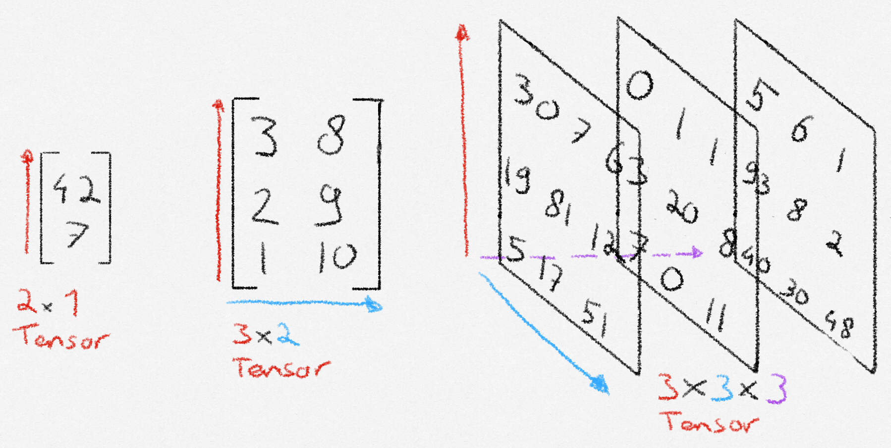

## What is a tensor?
If you are familiar with math, it might help to think about a tensor as an n-dimensional matrix. If you are not familiar with math, or just want a better explanation, you can think of a tensor as a collection of structured numbers that we can do *quick math* with. A tensor has two properties: shape, and dimension. *Shape* means how many numbers the tensor has along each axis. *Dimension* means the amount of axes that the tensor has. In the picture below, the dimension corresponds with the number of colored arrows, and the shape is denoted below the tensor.




## How to create a tensor?
First, `import torch`. After that we can create a tensor in two ways. From existing data, or with new data.

```{python}
#| echo: false
import torch
import numpy as np
```

```{python}
#| output: false
# Create a tensor from existing data
data = [[1, 2], [3, 4]]
tensor_from_data = torch.tensor(data)
print(tensor_from_data)

# Create a tensor with new data
ones_tensor = torch.ones((2,2))
print(ones_tensor)
```
<details>
<summary>Show output</summary>

```{python}
#| echo: false

print(tensor_from_data)
print(ones_tensor)
```

</details>


## How to do math with tensors?
There are three ways to perform a math operation in PyTorch. Lets see an example with addition.
```{python}
#| code-fold: true
#| code-summary: Initialization code

# Initialize tensors to do math with
shape = (2,2)
tensor1 = torch.rand(shape)
tensor2 = torch.ones(shape)
```
```{python}
#| output: false

# 1. Python operators
tensor1 + tensor2

# 2. Built-in tensor method
tensor1.add(tensor2)

# 3. Output tensor
output_tensor = torch.zeros(shape)
torch.add(tensor1, tensor2, out=output_tensor)
```

:::{.callout-note appearance="default"}
Currently, I am not sure about the difference between these three methods. I imagine that in a situation where we need to choose between these, one of the three method will feel most natural to use.
:::

## Some built-in tensor methods

There are over 1200 methods that we can perform on tensors. They can all be found at the [PyTorch documentation](https://docs.pytorch.org/docs/stable/torch.html). I skimmed through them and will give my beginner-opinion on which ones I believe will allow us to get a good start.


<details>
<summary><span class="foldable-h3">Mutating and indexing tensors</span></summary>
Knowing how to select and change individual elements as well as groups of elements is an essential skill to have, and easily learned. Indexing tensors works a lot like python list and numpy array indexing.

```{python}
tensor = torch.rand((3, 3))

first_row = tensor[0]
first_two_row = tensor[:2]
first_col = tensor[:, 0]
first_two_col = tensor[:, :2]
```

<details>
<summary>Show output</summary>

```{python}
#| echo: false


print("Entire tensor:")
print(tensor, '\n')
print("first row:")
print(first_row, '\n')
print(f"first two rows:")
print(first_two_row, '\n')
print("first column:")
print(first_col, '\n')
print(f"first two columns:")
print(first_two_col)
```

</details>

Lets now look at how to combine multiple tensors.
```{python}
tensor_ones = torch.ones((3,3))
tensor_ones[:, 0] = 4

# Combine multiple tensors horizontally
wide_combine = torch.cat((tensor, tensor_ones), dim=1)
even_wider_combine = torch.cat((tensor, tensor_ones, tensor_ones), dim=1)

# Combine multiple tensors vertically
high_combine = torch.cat((tensor, tensor_ones), dim=0)
```
<details>
<summary>Show output</summary>

```{python}
#| echo: false

print("Horizontal combine:")
print(wide_combine, '\n')
print("We can combine any number of tensors we want:")
print(even_wider_combine, '\n')
print(f"Vertical combine")
print(high_combine)
```

</details>
</details>

<details>
<summary><span class="foldable-h3">Comparing tensors</span></summary>
Just like with the math operations, we have different notation options to choose from when comparing tensors.

```{python}
#| output: false
tensor1 = torch.zeros((2,2))
tensor1[0][0] = 10
tensor2 = torch.ones((2,2))

# Check if two tensors are equal
torch.equal(tensor1, tensor2)
tensor1 == tensor2

# Check if one tensor is greater or equal to another tensor
torch.greater_equal(tensor1, tensor2)
torch.ge(tensor1, tensor2)
tensor1 >= tensor2
```

<details>
<summary>Show output</summary>

```{python}
#| echo: false
print("Tensor 1 equals tensor 2:")
print(tensor1 == tensor2, '\n')
print("Tensor 1 >= tensor 2:")
print(tensor1 >= tensor2)

```

</details>

Other comparison operators are implemented like the ones shown above in the way you probably expect. If you can't find the one you're looking for, there exists a [list of all comparison operators]((https://docs.pytorch.org/docs/stable/torch.html#comparison-ops)) on the PyTorch website.
</details>

<details>
<summary><span class="foldable-h3">More creation methods</span></summary>
Being able to instantiate a tensor with other values than ones and zeros is also possible.

```{python}
# Create a tensor filled with the number 3
threes = torch.full(size=(2,2), fill_value=3)

# Create a tensor based on the shape of another
tensor_with_shape = torch.rand((4, 3))
tensor_zeros = torch.zeros_like(tensor_with_shape)

```

<details>
<summary>Show output</summary>

```{python}
#| echo: false
print("threes:")
print(threes, '\n')
print("tensor_with_shape:")
print(tensor_with_shape, '\n')
print("tensor_zeros:")
print(tensor_zeros)
```

</details>

::: {.callout-tip}
The way we created `tensor_zeros` based on the shape of another tensor using `zeros_like` can also be done to the other ways we learned how to create a tensor, just by suffixing the method with `_like`.
:::

### Random numbers

```{python}
shape = (3,3)
# Set an optional seed for reproducibility
torch.manual_seed(1)

# Random integers 
rand_int = torch.randint(10, shape)
rand_int_lower_bound = torch.randint(8, 10, shape)

# Tensor values drawn from a distribution
normal = torch.randn(shape)

probability_tensor = torch.empty(shape).uniform_(0, 1) # The '_' suffix modifies the variable in place
bernoulli =torch.bernoulli(probability_tensor) # Pass a tensor with values of how likely a '1' is.

# Shuffle numbers from 0 to n-1 
permutation = torch.randperm(10)

```

<details>
<summary>Show output</summary>

```{python}
#| echo: false
print("rand_int):")
print(rand_int, '\n')
print("rand_int_lower_bound:")
print(rand_int_lower_bound, '\n')
print("normal:")
print(normal, '\n')
print("probability_tensor:", '\n')
print(probability_tensor)
print("bernoulli:")
print(bernoulli, '\n')
print("permutation:")
print(permutation, '\n')
```

</details>

</details>

Thank you for reading! Note that these are just the basics. Now is your time to do some work yourself. Read the documentation, and try some basic operations. As a starter, this post did not cover the different [linear algebra](https://docs.pytorch.org/docs/stable/linalg.html) operations, even though they are very useful! You might also peek at the more technical [GPU operations](https://docs.pytorch.org/docs/stable/cuda.html). See you on day 2!